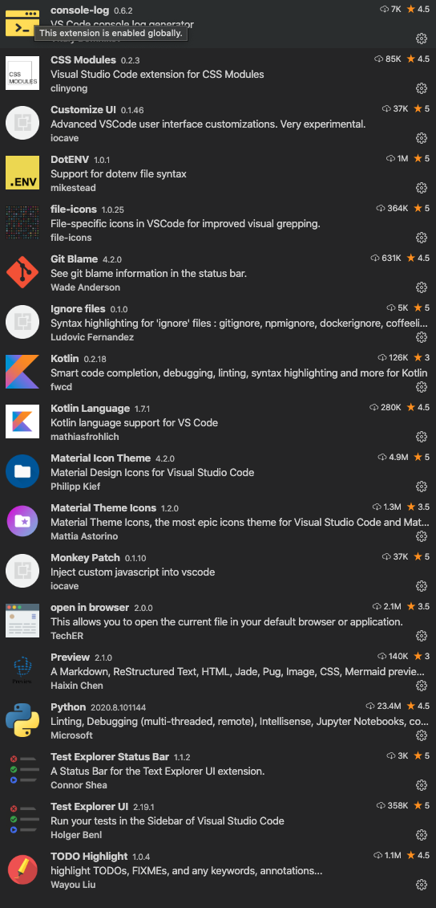

# Summary

VSCode configuration consists of...

- `/Users/tank/Library/Application \Support/Code/User/settings.json`
- `/Users/tank/Library/Application \Support/Code/User/keybindings.json`
- `/Users/tank/Library/Application \Support/Code/User/snippets/global.code-snippets.json`
- `/Users/tank/Library/Application \Support/Code/User/snippets/typescriptreact.json`
- `/Users/tank/Library/Application \Support/Code/User/snippets/testing.code-snippets.json`

Extensions can be found here...
```zsh
/Users/tank/.vscode/extensions/
```

Picture of running extensions

